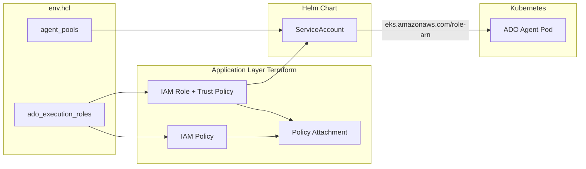

# IAM Roles and Policies for ADO Agent Deployments

This document describes how IAM roles and policies are defined, created, and managed for Azure DevOps (ADO) agents running in the EKS cluster. ADO agent pods assume IAM roles via **IRSA (IAM Roles for Service Accounts)**—no long-lived credentials are stored in containers.

## Overview



## 1. Configuration Source

### env.hcl

All IAM configuration for ADO agents is defined in `env.hcl` (or `env.sample.hcl`). Two related structures must be kept in sync:

| Structure | Purpose |
|-----------|---------|
| `ado_execution_roles` | Defines IAM roles, trust policies, and permission statements |
| `agent_pools` | Defines ADO agent pool configuration (Helm values) |

**Critical**: The **keys** in `ado_execution_roles` and `agent_pools` must match. The application layer uses the agent pool key to look up the corresponding IAM role ARN when building Helm values.

### ado_execution_roles Structure

```hcl
ado_execution_roles = {
  "<role_key>" = {
    namespace            = "ado-agents"      # Kubernetes namespace
    service_account_name = "ado-agent"       # Must match agent_pools.<key>.service_account_name
    permissions = [
      {
        effect    = "Allow"
        actions   = ["ecr:GetAuthorizationToken", "ecr:BatchGetImage"]
        resources = ["*"]
        condition = optional(object({        # Optional
          test     = string
          variable = string
          values   = list(string)
        }))
      }
    ]
  }
}
```

- **role_key**: Identifier used to name the IAM role and link to agent pools. Must match the key in `agent_pools`.
- **namespace**: Kubernetes namespace where the ServiceAccount lives (typically `ado-agents`).
- **service_account_name**: Name of the ServiceAccount. Must match `agent_pools.<role_key>.service_account_name`.
- **permissions**: List of IAM policy statements. Only `Allow` is supported; `Deny` is not.

### agent_pools Structure (Relevant Fields)

```hcl
agent_pools = {
  "<pool_key>" = {
    # ... other fields ...
    service_account_name = "ado-agent"   # Must match ado_execution_roles.<pool_key>.service_account_name
  }
}
```

The `pool_key` must exist as a key in `ado_execution_roles`. The `service_account_name` in the pool must match the `service_account_name` in the corresponding role.

## 2. Terraform Resources (Application Layer)

The application layer (`infrastructure-layered/application/`) creates IAM resources via Terraform modules.

### 2.1 IAM Role

**Module**: `module "ado_agent_execution_role"` (one per `ado_execution_roles` entry)

**Location**: [application/main.tf](../application/main.tf)

**Naming**: `{cluster_name}-ado-agent-{role_key}-role`

**Trust Policy**: The role trusts the EKS OIDC provider. Only the specified ServiceAccount in the specified namespace can assume the role:

```hcl
{
  "Effect": "Allow",
  "Principal": {
    "Federated": "<oidc_provider_arn>"
  },
  "Action": "sts:AssumeRoleWithWebIdentity",
  "Condition": {
    "StringEquals": {
      "<oidc_host>:sub": "system:serviceaccount:<namespace>:<service_account_name>",
      "<oidc_host>:aud": "sts.amazonaws.com"
    }
  }
}
```

The OIDC provider is created by the base layer and its ARN is passed via remote state.

### 2.2 IAM Policy

**Module**: `module "ado_agent_execution_policy"` (one per `ado_execution_roles` entry)

**Naming**: `{cluster_name}-ado-agent-{role_key}-policy`

**Content**: Built from the `permissions` list in `ado_execution_roles`. Each permission becomes a policy statement with:
- `Sid`: Auto-generated (e.g., `AllowADOAGENT01`)
- `Effect`: From permission (only `Allow` supported)
- `Action`: From permission
- `Resource`: From permission
- `Condition`: From permission (if present)

The transformation happens in `locals.ado_execution_policy_statements` in [application/main.tf](../application/main.tf).

### 2.3 Policy Attachment

**Module**: `module "ado_agent_execution_policy_attachment"`

Attaches the managed policy to the IAM role.

## 3. Helm Integration

The application layer builds Helm values from `agent_pools` and `ado_execution_roles`:

```hcl
serviceAccount = {
  name    = pool_config.service_account_name
  roleArn = module.ado_agent_execution_role[pool_name].role_arn
}
```

For each enabled agent pool, the Helm chart receives:
- `serviceAccount.name`: The Kubernetes ServiceAccount name
- `serviceAccount.roleArn`: The IAM role ARN for IRSA

The [Helm ServiceAccount template](../helm/ado-agent-cluster/templates/serviceaccount.yaml) adds the annotation:

```yaml
annotations:
  eks.amazonaws.com/role-arn: "<role_arn>"
```

When a pod uses this ServiceAccount, the EKS Pod Identity Webhook injects environment variables and a projected volume with short-lived credentials. The AWS SDK in the container uses these to assume the IAM role.

## 4. Base Layer Dependencies

The application layer depends on base layer outputs:

| Output | Purpose |
|--------|---------|
| `oidc_provider_arn` | ARN of the EKS OIDC identity provider (for trust policy) |
| `cluster_oidc_issuer_url` | OIDC issuer URL (e.g., `https://oidc.eks.us-west-2.amazonaws.com/id/xxx`) |

The base layer creates the OIDC provider when the EKS cluster is created. Without it, IRSA cannot work.

## 5. Default Roles

### ado-agent

- **Purpose**: General build and CI/CD workloads
- **Permissions**: ECR (GetAuthorizationToken, BatchCheckLayerAvailability, GetDownloadUrlForLayer, BatchGetImage, PutImage, InitiateLayerUpload, UploadLayerPart, CompleteLayerUpload)
- **Resources**: `*`

### ado-iac-agent

- **Purpose**: Terraform and infrastructure-as-code deployments
- **Permissions**:
  - ECR (same as ado-agent)
  - S3 (GetObject, PutObject, ListBucket) for Terraform state
  - STS (AssumeRole) for Terraform provider, restricted to roles matching `*terraform*`
- **Note**: Terraform >= 1.10 uses native S3 lockfiles; DynamoDB is not required for state locking.

## 6. Adding a Custom Role

1. **Add the role to `ado_execution_roles` in env.hcl**:
   ```hcl
   ado_execution_roles = {
     # ... existing roles ...
     ado-agent-s3 = {
       namespace            = "ado-agents"
       service_account_name = "ado-agent-s3"
       permissions = [
         {
           effect    = "Allow"
           actions   = ["s3:GetObject", "s3:PutObject", "s3:ListBucket"]
           resources = ["arn:aws:s3:::my-bucket", "arn:aws:s3:::my-bucket/*"]
         }
       ]
     }
   }
   ```

2. **Add a matching agent pool in `agent_pools`** (use the same key as the role):
   ```hcl
   agent_pools = {
     # ... existing pools ...
     ado-agent-s3 = {
       enabled           = true
       ado_pool_name    = "EKS-S3-Agents"
       service_account_name = "ado-agent-s3"
       ecr_repository_key  = "ado-agent"
       # ... resources, autoscaling, etc.
     }
   }
   ```

3. **Apply the application layer**:
   ```bash
   ./deploy.sh deploy --layer application
   ```

4. **Create the ADO agent pool** in Azure DevOps with the same name as `ado_pool_name`.

## 7. Policy Statement Options

### Condition Block

Use `condition` for least-privilege constraints:

```hcl
{
  effect    = "Allow"
  actions   = ["sts:AssumeRole"]
  resources = ["arn:aws:iam::123456789012:role/my-role"]
  condition = {
    test     = "StringEquals"
    variable = "sts:ExternalId"
    values   = ["my-external-id"]
  }
}
```

### Resource ARN Constraints

Prefer explicit ARNs over `*`:

```hcl
resources = [
  "arn:aws:s3:::my-terraform-bucket",
  "arn:aws:s3:::my-terraform-bucket/*"
]
```

### Cross-Account Assume Role

For Terraform or other tools that assume roles in other accounts:

```hcl
{
  effect    = "Allow"
  actions   = ["sts:AssumeRole"]
  resources = ["arn:aws:iam::*:role/*terraform*"]
}
```

The wildcard `*` in the account ID allows assuming roles in any account; tighten with specific account IDs or role name patterns as needed.

## 8. Troubleshooting

| Symptom | Cause | Resolution |
|---------|-------|------------|
| Pod cannot assume role | Trust policy `sub` condition does not match | Verify `namespace` and `service_account_name` in `ado_execution_roles` match the actual ServiceAccount |
| Role ARN not on pod | Pool key mismatch or application layer not applied | Ensure `agent_pools` and `ado_execution_roles` share the same keys; re-apply application layer |
| Permission denied | Policy missing required actions | Add the needed actions to the role's `permissions` in env.hcl |
| OIDC provider not found | Base layer not deployed | Deploy base layer first; OIDC provider is created with the cluster |

### Verify Role Assumption from a Pod

```bash
kubectl exec -it -n ado-agents deployment/ado-agent -- aws sts get-caller-identity
```

Expected output shows the assumed role ARN.
